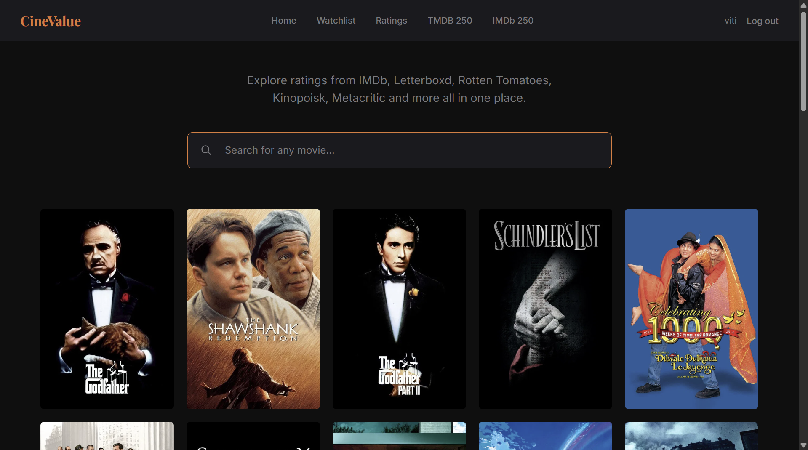
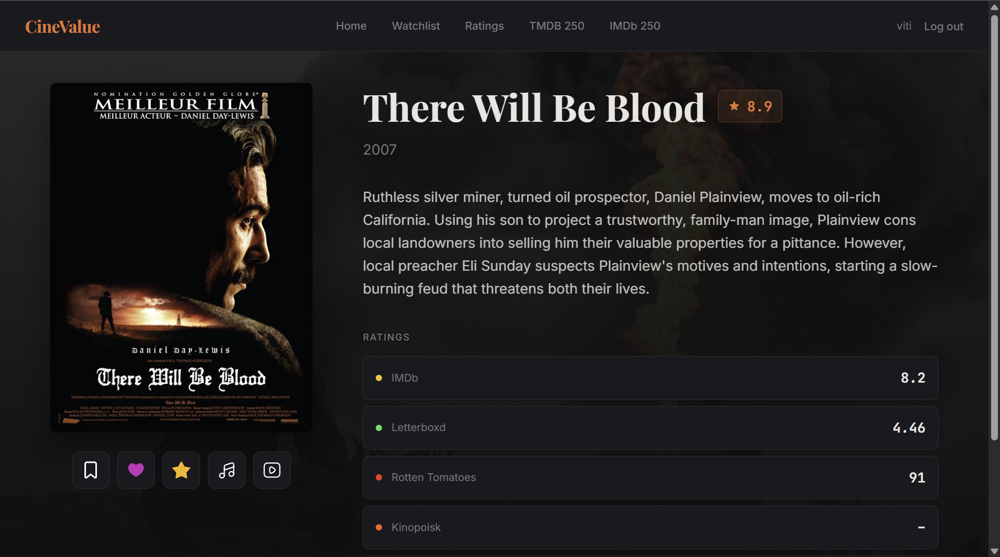
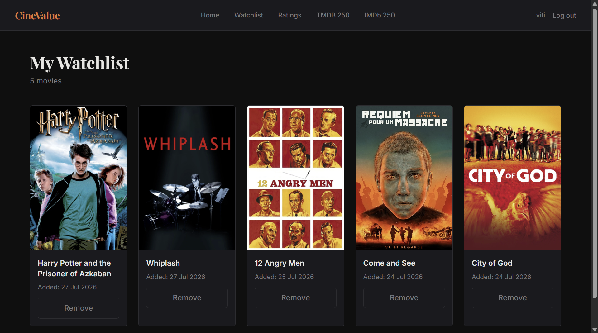
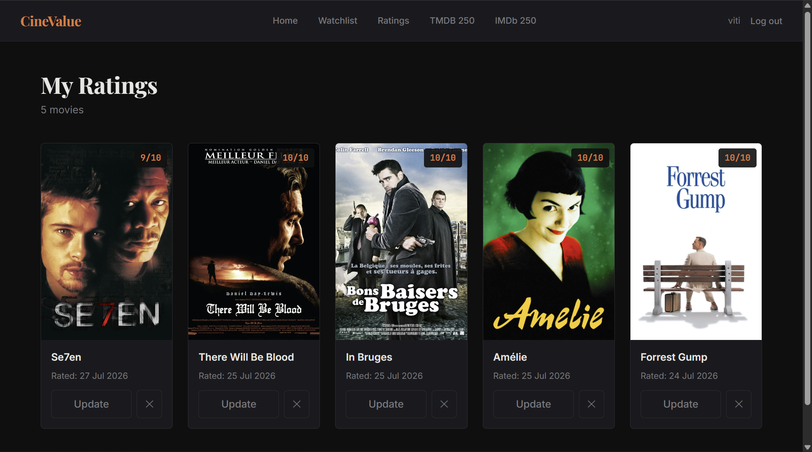

# CineValue


CineValue is a Django web application that aggregates movie ratings from **IMDb**, **Letterboxd**, **Rotten Tomatoes**, **Metacritic**, and **Kinopoisk** into a single clean interface. Instead of checking multiple websites, CineValue calculates a unified score, fetches movie soundtracks via YouTube Music, and lets you manage your personal watchlist and ratings and lets you watch trailers.
---

## ✨ Key Features

- **Unified Rating Aggregation**: View ratings from IMDb, Letterboxd, Rotten Tomatoes, Metacritic, and Kinopoisk in one place, along with a calculated weighted average score.
- **Movie Catalog**: Powered by a local database [Kaggle TMDB Movies Dataset (930k+ movies)](https://www.kaggle.com/datasets/asaniczka/tmdb-movies-dataset-2023-930k-movies).
- **Fast Search**: Instant auto-suggest dropdown using debounced live search.
- **Soundtracks & Links**: Automatically finds official movie soundtrack playlists on YouTube Music and direct links to platform pages.
- **User Collections**:
  - **Watchlist**: Save movies to watch later.
  - **Liked Movies**: Keep track of favorite films.
  - **My Ratings**: Rate movies from 1 to 10 and review your rating history.
- **Top Curated Lists**: Browse TMDB Top 250 and IMDb Top 250 collections.
- **Telegram Bot (WIP)**: Early prototype bot (`aiogram 3`) for quick movie search directly from Telegram. idk who needs it 

---

## Screenshots


| Home Page & Search | Movie Details & Aggregated Ratings |
| :---: | :---: |
|  |  |

| User Watchlist | Ratings History |
| :---: | :---: |
|  |  |

---

## 🔌 Data Sources & External APIs

To deliver aggregated scores and metadata without relying on a single source, CineValue integrates:

- **Local PostgreSQL Database**: Seeded using the [TMDB Movies Dataset on Kaggle](https://www.kaggle.com/datasets/asaniczka/tmdb-movies-dataset-2023-930k-movies) for titles, release years, overviews, genres, TMDB IDs, and poster paths.
- **WhatsOn API**: Provides ratings, review URLs, and critic/user details for IMDb, Letterboxd, Rotten Tomatoes, and Metacritic based on TMDB IDs.
- **Kinopoisk Dev API**: Retrieves Kinopoisk user ratings and vote counts.
- **YouTube Music API (`ytmusicapi`)**: Queries YouTube Music to match and link official movie soundtrack playlists.

Requests to external APIs are fetched asynchronously (`httpx`, `asyncio.gather`) and cached locally in Django's cache layer to reduce latency and API consumption.

---

## Tech Stack

- **Backend**: Python 3.10+, Django 5.2, PostgreSQL, `httpx`, `ytmusicapi`
- **Frontend**: HTML5, Django Templates, Tailwind CSS v4, Vanilla JavaScript
- **Telegram Bot**: `aiogram 3.x` (Experimental / Work in progress)
- **Testing**: `pytest`, `pytest-django`, `pytest-asyncio`

---

## Project Structure

```text
├── CineValue/                 # Main Django application
│   ├── api_services/          # External API integrations (Kinopoisk, WhatsOn, YouTube Music)
│   ├── models/                # Database models (Movie, WatchList, Liked, Rating, IMDb250)
│   ├── services/              # Business logic (MovieDetailService)
│   ├── templates/             # HTML templates
│   ├── utils/                 # Rating calculation, validators, rate limiting
│   └── views/                 # Views (Auth, Movies, Watchlist, Ratings, Likes)
├── bot/                       # Telegram bot prototype (aiogram)
│   ├── handlers/              # Bot command and query handlers
│   └── management/commands/   # Django management command `runbot`
├── movie/                     # Django project settings and root URLs
├── static/                    # Built Tailwind CSS and vector icons
└── requirements.txt           # Python dependencies
```

---

## 🚀 Getting Started

### 1. Prerequisites

- Python 3.10 or higher
- PostgreSQL database
- Node.js & npm (for Tailwind CSS build)

### 2. Installation

1. **Clone the repository**:
   ```bash
   git clone https://github.com/your-username/CineValue.git
   cd CineValue
   ```

2. **Set up a virtual environment**:
   ```bash
   python -m venv .venv
   source .venv/bin/activate  # On Windows: .venv\Scripts\activate
   ```

3. **Install dependencies**:
   ```bash
   pip install -r requirements.txt
   npm install
   ```

4. **Configure environment variables**:
   Create a `.env` file in the root directory (refer to `.env.example`):
   ```env
   SECRET_KEY=your_django_secret_key
   DEBUG=True

   DB_NAME=cinevalue_db
   DB_USER=postgres
   DB_PASSWORD=your_postgres_password
   DB_HOST=localhost
   DB_PORT=5432

   KINOPOISK_API_KEY=your_kinopoisk_dev_key
   TELEGRAM_BOT_TOKEN=your_telegram_bot_token  # Optional for bot
   ```

5. **Run migrations and build CSS**:
   ```bash
   python manage.py migrate
   npm run build
   ```

6. **Start the development server**:
   ```bash
   python manage.py runserver
   ```
   Open `http://127.0.0.1:8000` in your browser.

7. **Run the Telegram bot (Optional)**:
   ```bash
   python manage.py runbot
   ```

---

## Running Tests

Run unit and integration tests with pytest:

```bash
pytest
```

---

## Telegram Bot Status

The Telegram bot inside the `bot/` directory is currently not finished
